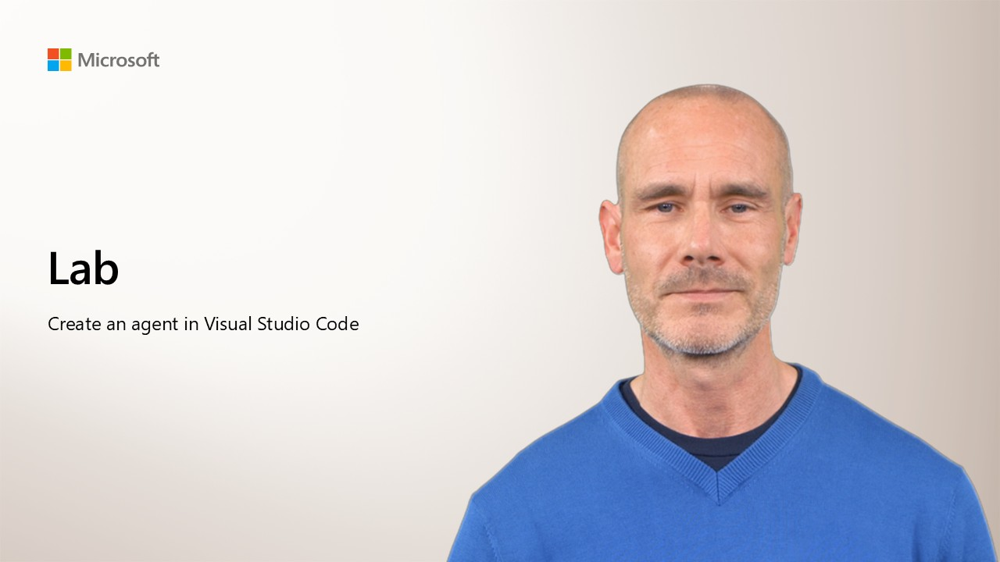

  

*Update the [first Agent Dev lab](https://microsoftlearning.github.io/mslearn-ai-agents/Instructions/Exercises/01-build-agent-portal-and-vscode.html) to minimize initial portal steps, and add tools using the SDK.*

*Or, use the [second lab](https://microsoftlearning.github.io/mslearn-ai-agents/Instructions/Exercises/02-agent-custom-tools.html) and have them create an agent in VS Code from scratch with custom functions (which is a good rationale for using VS Code instead of the portal)*.

### Before you start

You'll need an Azure subscription in which you have sufficient permissions to create and manage a Foundry resource. You can [sign up for a new subscription](https://azure.microsoft.com/pricing/purchase-options/azure-account?cid=msft_learn){:target="_blank"} if you don't already have one.

### Lab instructions

When you're ready to start the lab, open the **[lab instructions](https://microsoftlearning.github.io/mslearn-ai-agents/Instructions/Exercises/01-build-agent-portal-and-vscode.html){:target="_blank"}** in a new browser tab.

>  **[Ask Anton](https://aka.ms/choose-anton){:target="_blank"}**
>
> Don't forget, I'm here to help with any questions you might have when completing the lab.
