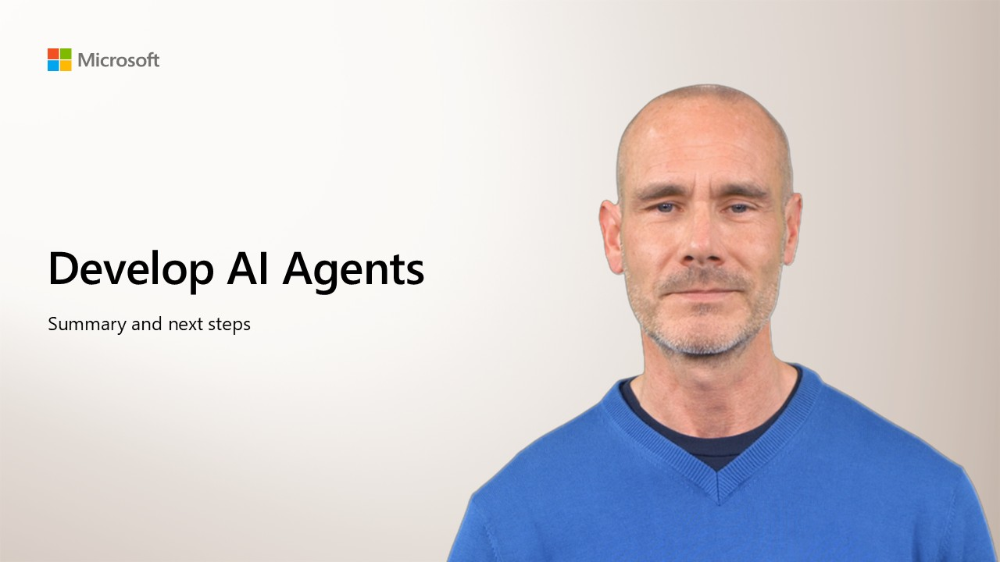

  

In this workshop, you've learned how to create Ai agents in Microsoft Foundry.

There's a lot more to AI development on Microsoft Azure. Continue your journey with the following learning paths in AI Skills Navigator:

- [Develop Generative AI apps in Azure](https://aiskillsnavigator.microsoft.com/explore/search/learningpath-83c73f92b07ec44b678fe87608ac5812111e0caacf7308b47afccec1f274ccc4)
- [Develop AI agents on Azure](https://aiskillsnavigator.microsoft.com/explore/search/learningpath-e479cf28c8a127f98d3d45961214485266d85b486991cebf33fe779fb53a0190)
- [Develop natural language solutions on Azure](https://aiskillsnavigator.microsoft.com/explore/search/learningpath-37cace5b5d91825002d4c09e3f3f98d9027e1b2a79b490b663684c4703361ca7)
- [Extract visual insights from data on Azure](https://aiskillsnavigator.microsoft.com/explore/search/learningpath-d0b0e550fda9d8fc957788736aaee66351967ea44dbad310f4f8dae94a21cfa2)
- [Develop AI Information Extraction solutions on Azure](https://aiskillsnavigator.microsoft.com/explore/search/learningpath-796e69a13e07dffb16c3a979eb65711e5884ecee17cf595f4eb9b604e919a428)

>  **[Ask Anton](https://aka.ms/choose-anton){:target="_blank"}**
>
> Ask me how GitHub Copilot can help you develop AI apps and agents.
